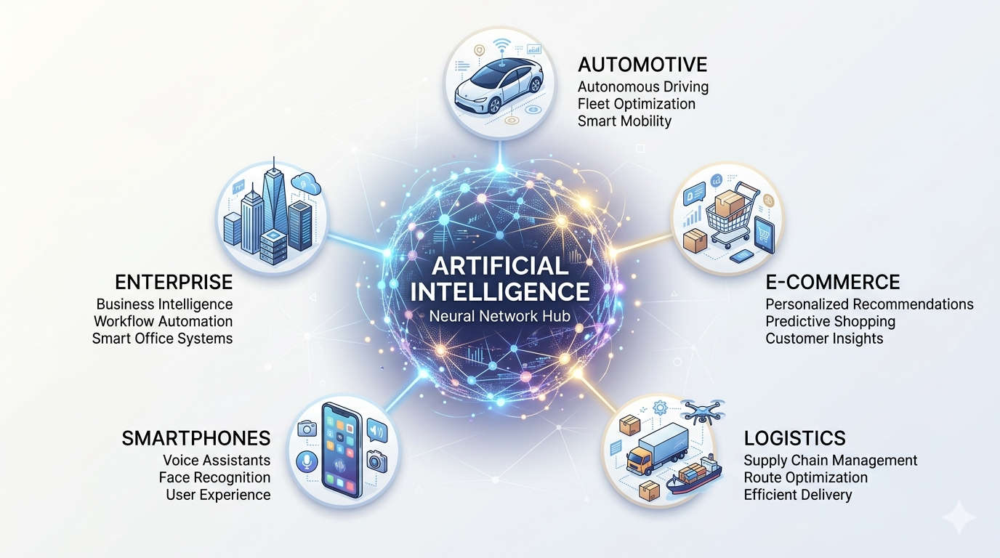

# AI Talk

---

# AI Landscape



---

# Slide 2 — Expectations
*Ajitem Sahasrabuddhe*

---

# The Moment AI stopped being a tool

```shell
> Upgrade my project to Java 17
```

```shell
> Thinking...
> I need permission to update your project files: y/n
```

```shell
> y
```

```shell
> Thinking...

Detected Java 7 → upgrading to Java 17
Updating Gradle dependencies...
Refactoring deprecated APIs...
Running build checks...
Migration completed. Project successfully migrated to Java 17 and the build is passing.

Summary:
* Code upgraded from Java 7 to Java 17
* Gradle version upgraded from 1.9 to 8.5.1
* Deprecated methods replaced with their upgraded contracts
```

## WOW!! 😮

---

# The Bittersweet Reality

The WOW moment fades fast! 😕

- Same prompt, different results
- Repeating instructions

Why?

---

# Slide 5 — The Mindset Shift
*Ajitem Sahasrabuddhe*

---

# The Journey with Agents

What exactly is a "context"?

<v-click>
<blockquote>
Context is everything AI needs to not ask you a clarifying question.
</blockquote>
</v-click>

---

# Slide 7 — Ways to Build Context
*Ajitem Sahasrabuddhe*

---

# Same Tool, Different Outcomes

<div class="grid grid-cols-2 gap-8 items-center mt-8">

<div>

#### 🤔 Person A
Google → ❌ Random results

<br/>

#### ⚡ Person B
Google → ✅ Exact answer

</div>

<div>

- Same tool
- Same access
- Different outcomes

</div>

</div>

<br>
<br>

<v-click>
<blockquote>It's not knowing AI. It's about how to <em>communicate</em> with it.
</blockquote>
</v-click>

---

# Slide 9 — Breaking the Myths
*Kush Saraiya*

---

# Slide 10 — Live Demo
*Ajitem Sahasrabuddhe*

---

# Slide 11 — Bring Your Own Problem
*Kush Saraiya · Ajitem Sahasrabuddhe*

---

# Slide 12 — Best Practices & Limitations
*Kush Saraiya · Ajitem Sahasrabuddhe*
